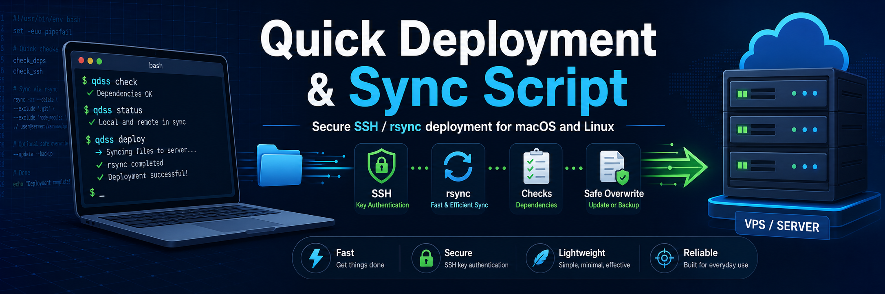

# 🚀 Quick Deployment & Sync Script



*[Read this in 繁體中文](README_cn.md)*

This is a Bash script designed to quickly synchronize your local project files to a remote server (e.g., VPS, Baota Panel server).
It uses `rsync` for efficient differential transfers, defaults to **SSH Key Login**, and still supports password login when needed.

## 🌟 Features

- **Bilingual Prompts**: Includes bilingual (English/Chinese) comments and terminal outputs within the script.
- **Multiple Login Methods**: Defaults to SSH key authentication and supports automated password login via `sshpass`.
- **Dependency Checks**: Checks required local and remote commands before deployment.
- **Optional Full Overwrite**: Remote directory cleanup is disabled by default and can be explicitly enabled.
- **Safer Failure Handling**: Exits with a non-zero status when validation, dependency checks, SSH, or `rsync` fails.
- **Highly Customizable**: Easily customize the target paths and file patterns to upload.

## 🛠️ Requirements

### Local Machine
- OS: macOS / Linux
- Dependencies:
  - `bash`
  - `ssh`
  - `rsync`
  - `sshpass` (**Only required if using password login**)
    - macOS: `brew install hudochenkov/sshpass/sshpass`
    - Linux: `apt-get install sshpass` or `yum install sshpass`

### Remote Server
- Required dependencies:
  - `rsync`
  - `mkdir`
- Additional dependencies when `FULL_OVERWRITE_REMOTE_DIR=true`:
  - `find`
  - `rm`

The script checks these dependencies automatically and exits with an installation hint if something is missing.

## ⚙️ Configuration

Open `deploy.sh` and set your connection and path information at the top of the file:

1. **Server Connection Info**
   Fill in `SERVER_USER`, `SERVER_IP`, and `SERVER_PORT`.

2. **Authentication Method**
   - **SSH Key Login (default)**: Keep `AUTH_METHOD="key"`. Leave `SERVER_SSH_KEY` empty to use your default SSH identity or `ssh-agent`, or set it to an absolute key path.
   - **Password Login**: Set `AUTH_METHOD="password"` and fill in `SERVER_PASSWORD`. This mode requires `sshpass`.

3. **Target and Source Settings**
   - `REMOTE_DIR`: The absolute target path on the remote server (e.g., your website root `/var/www/html/your_project/`).
   - `TARGET_FILES`: The local files or folders to upload. This is a Bash array, for example:

```bash
TARGET_FILES=(dist/* public/ "config/app.json")
```

4. **Remote Cleanup**
   - `FULL_OVERWRITE_REMOTE_DIR=false` by default. The script creates the remote directory if needed, but does not delete existing files.
   - Set `FULL_OVERWRITE_REMOTE_DIR=true` only when you want to clear the remote directory before uploading.

## 🚀 Usage

Navigate to the directory containing the script in your terminal, grant execution permissions, and run it:

```bash
chmod +x deploy.sh
./deploy.sh
```

## ⚠️ Notes

- By default, this script does **not** clear the remote directory. Full overwrite is opt-in through `FULL_OVERWRITE_REMOTE_DIR=true`.
- `REMOTE_DIR` must be an absolute path and cannot be `/` or common high-risk system directories such as `/root`, `/home`, `/var`, or `/usr`.
- Password login is supported, but SSH key authentication is recommended for regular deployment.
- Avoid uploading `deploy.sh` containing real passwords or private key paths to public GitHub repositories. It is highly recommended to add it to your `.gitignore`.
